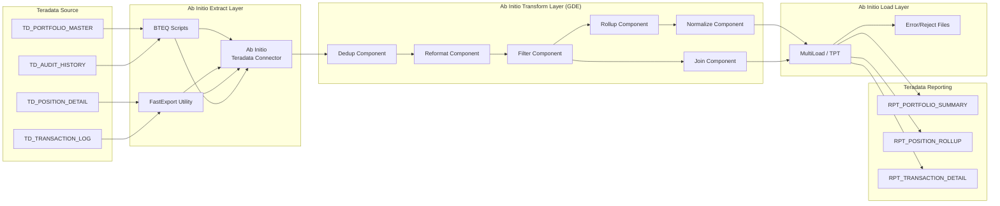

# Ab Initio Legacy ETL Documentation

## Overview

This directory documents the **existing Ab Initio ETL pipeline** that manages data movement and transformation within the Teradata-based Investment Portfolio Management System. This represents the **"before" state** that Devin will displace.

## Current Architecture

The Ab Initio Co>Operating System runs three primary ETL graphs managed via the Ab Initio GDE (Graphical Development Environment):

### Graph 1: Teradata Extract (BTEQ/FastExport)

- **Component**: Ab Initio Teradata Connector
- **Method**: BTEQ scripts + FastExport utility
- **Source Tables**: `TD_PORTFOLIO_MASTER`, `TD_POSITION_DETAIL`, `TD_TRANSACTION_LOG`, `TD_AUDIT_HISTORY`
- **Output**: Ab Initio serial/parallel datasets (.dat files)
- **Schedule**: Daily batch at 02:00 AM EST
- **Estimated Runtime**: 45-90 minutes depending on data volume

### Graph 2: Transform & Enrich (GDE Graphs)

Multiple Ab Initio transform components chained together:

1. **Dedup Component** - Removes duplicate portfolio records using `PORT_ID` as key
2. **Reformat Component** - Maps Teradata column names to reporting schema
3. **Filter Component** - Removes invalid/null records (data quality gate)
4. **Rollup Component** - Aggregates positions by portfolio, calculates totals
5. **Join Component** - Enriches transaction data with portfolio metadata
6. **Normalize Component** - Standardizes currency codes, date formats

### Graph 3: Load to Reporting (Teradata Load)

- **Component**: Ab Initio Teradata Load utility
- **Target Tables**: `RPT_PORTFOLIO_SUMMARY`, `RPT_POSITION_ROLLUP`, `RPT_TRANSACTION_DETAIL`
- **Method**: MultiLoad / TPT (Teradata Parallel Transporter)
- **Error Handling**: Reject file + error log to Ab Initio DMP

## Data Flow Diagram

## Cost & Complexity Analysis

| Dimension | Current State (Ab Initio) |
|---|---|
| **License Cost** | ~$500K-$1M/year (Ab Initio Co>Operating System) |
| **Infrastructure** | Dedicated Ab Initio servers + Teradata appliance |
| **Development Tool** | Ab Initio GDE (proprietary graphical IDE) |
| **Skills Required** | Ab Initio certified developers (scarce, expensive) |
| **Vendor Lock-in** | Complete - proprietary data format, runtime, IDE |
| **Deployment** | Manual graph promotion through Ab Initio EME |
| **Monitoring** | Ab Initio Operations Console (separate license) |
| **Data Format** | Proprietary Ab Initio serial/parallel datasets |
| **Change Velocity** | 2-4 weeks per graph change (dev + test + promote) |
| **Testing** | Ab Initio Component Test Framework (limited) |

## Known Issues

1. **Performance degradation** during month-end when transaction volumes spike 3x
2. **Single point of failure** - Ab Initio server outage stops all ETL
3. **No version control** - GDE graphs stored in Ab Initio EME, not Git
4. **Limited observability** - Monitoring requires Ab Initio Operations Console access
5. **Teradata lock-in** - All data stays within Teradata ecosystem, no open format support

## Files in This Directory

| File | Description |
|---|---|
| `README.md` | This document |
| `abinitio_graph_spec.yaml` | Detailed YAML specification of all Ab Initio graph components |
